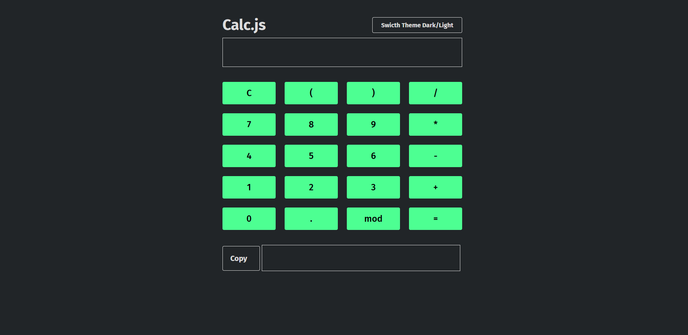

# Calc.js

Calculadora simples construída com HTML, CSS e JavaScript puro (vanilla), sem frameworks ou dependências externas.



## Funcionalidades

- Operações básicas: adição, subtração, multiplicação, divisão e módulo
- Suporte a parênteses para expressões compostas
- Entrada via cliques nos botões **ou** via teclado
- Alternância entre tema claro e escuro
- Botão para copiar o resultado para a área de transferência

## Tecnologias

- HTML5
- CSS3 (custom properties para theming)
- JavaScript (DOM API nativa)

## Como Acessar

**[Clique aqui para testar a calculadora](https://esdrasioseph.github.io/calc.js/)**

## Estrutura do projeto

```
calc-js/
├── index.html
├── style.css
└── script.js
```

## Decisões técnicas

- O tema (claro/escuro) é controlado via CSS custom properties, trocadas dinamicamente por JavaScript. Estados de `:hover` também usam uma variável (`--hover-color`), evitando duplicar listeners de mouse e mantendo o hover sob controle do CSS.
- A entrada de teclado é validada por meio de uma lista de caracteres permitidos antes de ser aceita, para reduzir entradas inesperadas.

## Notas técnicas

Este projeto usa `eval()` para calcular as expressões digitadas. É uma prática geralmente desencorajada, já que `eval()` executa qualquer string como código javascript, mas aqui essa foi uma escolha consciente para esse estágio do aprendizado e em razão da simplicidade do projeto.

## Autor

Desenvolvido por Esdras Ioseph Brandão.

- Estudante de Análise e Desenvolvimento de Sistemas.